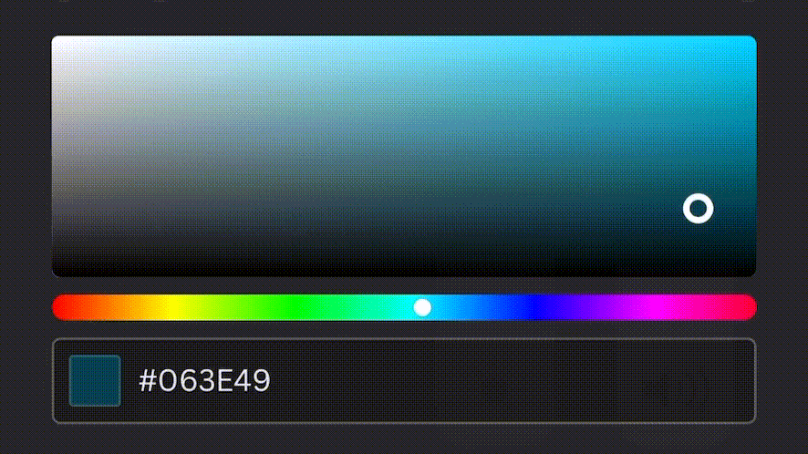

# Regular Expression Tutorial
# 🎨Matching a Hex Value 🎨

This tutorial file goes step by step through each part of the regex espression for hexadecimal color codes and breaks down what each part of the expression means. 

## Summary

Hex value color codes are used in web development for styling. There are upwards of 16 million colors in the hex value format, so understanding how a string complies with the formatting of this color code pattern is helpful in better understanding the background of web develipment. 

*Below is a video showing different hex codes for different colors:*

## Table of Contents

- [Anchors](#anchors)
- [Quantifiers](#quantifiers)
- [Grouping Constructs](#grouping-constructs)
- [Bracket Expressions](#bracket-expressions)
- [Character Classes](#character-classes)
- [The OR Operator](#the-or-operator)
- [Flags](#flags)
- [Character Escapes](#character-escapes)

## Regex Components

### Anchors
Anchors in a regular expression are indicators that the string is starting or ending. The '^' and '$' in this expression are both anchors which tell the computer where to start looking for the expression and when the expression is over.

>*The following hex value statement highlights the anchors in gold:*

>/`^`#?([a-f0-9]{6}|[a-f0-9]{3})`$`/

* **Start:** '^' indicates the string is starting
* **End:** '$' indicates the end of the string. 

### Quantifiers
Quantifiers set limits on your regex string. They can either indicate things that need to be present in the string or can set a number of characters that a certian part of the string needs to have. The two quantifiers that are present in hex value strings are question marks and curly brackets.

>*The following hex value statement highlights the qualtifiers in gold:*

>/^#`?`([a-f0-9]`{6}`|[a-f0-9]`{3}`)$/

* **Question Mark '?':** A question mark means anything that comes before the question mark in the string is optional. In the hex value regex, a # is placed before the ? meaning that the hex color code can have a # in it, or not, either way is fine. 

* **Curly Brackets '{}':** Curly brackets are quantifiers that indicate how many characters should be in the previous bracket expression (more on those below). In the hex value regex, there is one set of curly brackets with a 6 in it, and one with a 3 in it, meaning the bracket expressions right before the curly brackets must contain 6 or 3 respectively. 

### Grouping Constructs
Grouping constructs are used to group parts of the regular expression together. For the hex value regex, there is just one grouping with two patterns in it. 

>*The following hex value statement highlights the grouping constructs in gold:*

>/^#?`(`[a-f0-9]{6}|[a-f0-9]{3}`)`$/

* **Parentheses '()':** Parentheses are used as grouping constructs where everything after the open parentheses and before the closing parentheses are in the same group. In the hex value expression, "a set of 6 characters" or "a set of three characters" are grouped together, meaning the computer reading this expression should look for either of those things and treat it as one input.

### Bracket Expressions
Inside the bracket expressions is where the set of characters that any character within the input string must be equal to. 

>*The following hex value statement highlights the bracket expressions in gold:*

>/^#?(`[a-f0-9]`{6}|`[a-f0-9]`{3})$/

* **Brackets '[]':** The bracket expressions define what characters can be used. In the hex expression, [a-f0-9] means any single character in the string must be a letter a-f or a number 0-9.

### Character Classes

The character classes define a set of characters that the input string needs to match. 

>*The following hex value statement highlights the character classes in gold:*

>/^#?([`a-f0-9`]{6}|[`a-f0-9`]{3})$/

* **Letter Classes [a-z]:** The letter classes define what letters can be used for the input string. [a-z] would mean any letter a-z can be used in the string. For the hex value expression, [a-f] is used meaning the letters in the string must match letters a-f.

* **Number Classes [0-9]:** Similarly, the number classes define what letters can be used for the input string. For the hex value expression, any number 0-9 can be used indicated by the [0-9]. If this instead said [0-5] for example, it would mean only numbers from 0-5 can be used. 

### The OR Operator
The OR operator indicates a choice between two options within the expression. 

>*The following hex value statement highlights the character classes in gold:*

>/^#?([a-f0-9]{6}`|`[a-f0-9]{3})$/

* **The Pipe '|':** the pipe indicates an 'or'. In this context, it's used between [a-f0-9]{6} and [a-f0-9]{3} meaning this expression is looking for either a 6 character string of letters a-f and numbers 0-9 OR a 3 character string of letters a-f and numbers 
0-9.

### Flags
Though the hex value regex doesn't contain any flags, it's still helpful to understand what flags are in case you come across them. As literals, regex expressions must be wrapped in slash characters. Occasionally there will be an extra character at the end of the regex after the slash which is known as a flag. The flag inficates extra functionality or limits for the specific regex.

Here are the three most specific flags and what they mean

>* **'g' - Global search:** Usually a regex search stops after it finds a match, but with this flag it keeps searching for every single possible match
>* **'i' — Case-insensitive search:** Usually searches are case sensitive. If this flag is attached, the search doesn't care if a letter is uppercase or lowercase. 
>* **'m' — Multi-line search:** This flag is used on multi line string inputs and allows the expression to search each string individually. 

### Character Escapes
Character escapes allow special characters to be used in a regex pattern. 

>*The following hex value statement highlights the character escape in gold:*

>/^`#`?([a-f0-9]{6}|[a-f0-9]{3})$/

* **"#' Hash mark:**: In the hex value expression, a hash mark is a special character that may or may not be present in the string. It's placed in the regex expression with a '?' after it to indicate that "if it's there, it's fine". 

## Author

My name is Hunter Reed and I am a student in the University of Denver Full Stack Bootcamp. I can be reached through my github profile or email:

* GitHub: [@huntrreed](https://github.com/huntrreed)

* Email: huntrreed@gmail.com